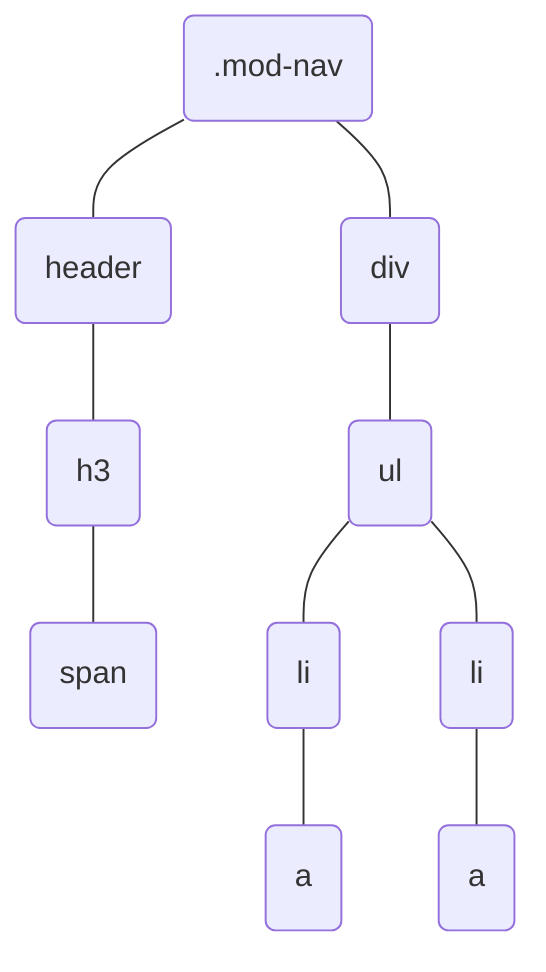

## 浏览器是如何渲染UI的？

1. 解析HTML文件，形成DOM Tree
2. 同时解析css，生成style rules
3. 前两者结合合成Render Tree
4. 进入布局 Layout 阶段，为每个节点分配屏幕上的坐标
5. Paint阶段，遍历Render Tree 将元素呈现出来


## CSS选择器的解析顺序？

从右向左的顺序还是从左向右的顺序？

答案：**从右向左**

生成Render Tree需要将style rules作用于 DOM Tree上，所以要依据选择器的信息对DOM Tree进行遍历。

以下面的样式为例

```css
.mod-nav h3 span {
    font-size: 16px
}
```

以下面的DOM Tree为例



从左向右即从根节点出发匹配：

1. 从 .mod-nav出发向各自的子节点 header div遍历
2. 左侧.mod-nav找到了符合的，右侧的 div分支中
3. 从ul一直遍历到最根部的节点a，发现不符合然后回到ul再遍历到右侧的a发现不符合。这种查找方法必须遍历所有的DOM节点才能找到所有符合的DOM元素，没有裁剪。


当从右向左匹配的时候：

1. 先找所有符合的span节点，对于每一个span节点再去寻找其父节点是h3的DOM。这一步就把右侧a向上查找li的过程给剔除了。
2. 然后h3向上查找.mod-nav的节点