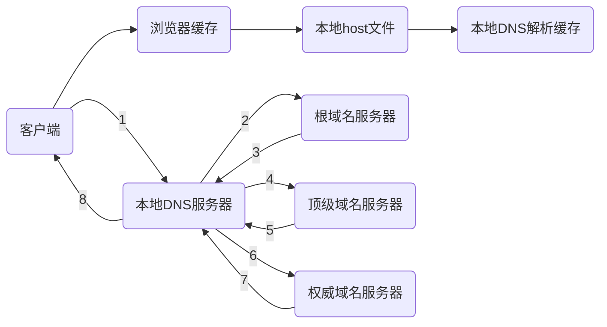
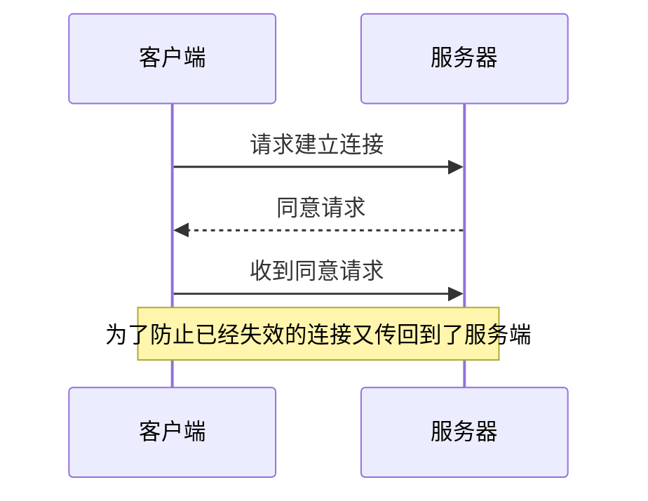
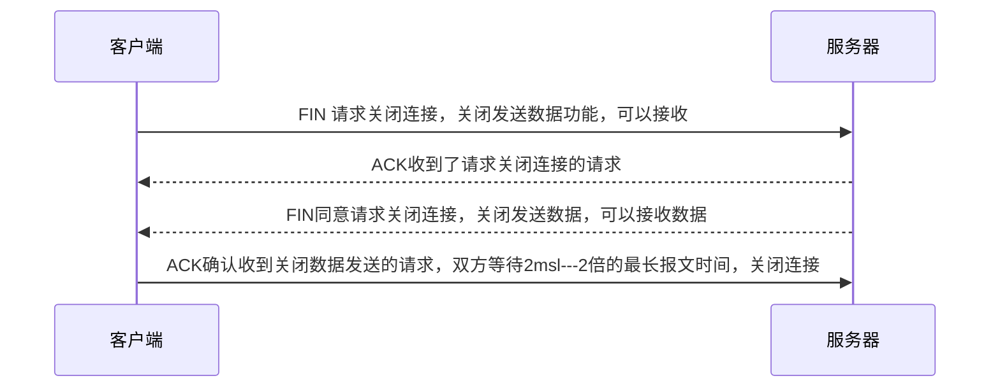

## url到页面全过程

概况：

+ [DNS解析](#DNS解析)
+ [TCP连接](#TCP连接)
+ [http请求](#http请求)
+ [DOM解析](#DOM解析)

<h2>DNS解析</h2>

根据域名获取IP地址，先看本地缓存，然后host文件、然后本地DNS解析。以上任何一步获得ip后进行下一步。

如果本地DNS也没拿到IP地址，则按下图进行迭代查找。

询问根域名服务器，没有在返回顶级域名服务的地址，让你再去问顶级域名服务器，依次向上查找。

<h2>TCP连接</h2>

### 三次握手

获得ip后经过三次握手建立tcp连接。

+ 第一次：**服务器** 确认 **客户端** 有发送数据的能力
+ 第二次：***客户端***确认了 **服务器** 有接收和发送数据的能力
+ 第三次：**服务器**确认了**客户端**有有接收数据的能力

### 四次挥手

结束请求后，会经过四次挥手来关闭连接。

<h2>http请求</h2>

客户端请求资源，服务器处理响应。

客户端在首次请求资源的时候会根据服务器的响应头来决定是否缓存。

客户端再次请求资源的时候，如果命中了缓存资源，会根据缓存策略来决定是否读取缓存资源。

**强缓存：**

+ Expires: 设置了过期时间，则在规定时间被不会再次请求 `expires: Wed, 28 Nov 2018 19:43:05 GMT`
+ Cache-Control: 在这个请求的多少时间内不会再次请求`cache-control: public, max-age=31536000`
  + public：指示想要可以被任何用户缓存，包括CDN、代理商等
  + private：只能被浏览器终端缓存
  + no-cache：缓存在本地，命中缓存后进行协商缓存
  + no-store：不产生任何缓存

**协商缓存：**当Cache-Control: no-cache的时候出现

+ `Last-Modified/If-Modified-Since` ：第一次请求资源的时候，服务端会给一个最新修改时间，比如`Last-Modified: XXX`，客户端下次请求数据的时候会带上这个时间信息，会在请求头增加`If-Modifed-Since: XXX`，然后服务器根据此对比资源是否是最新的，如果未过期则返回304，过期了返回200。

  + 需要注意的是200里面分 `from memory cache`和`from disk cache`，两者的区别是页面的tab关闭后只能从disk cache取，而 memory cache 则页面刷新的时候才会存在

+ `ETag/If-None-Match`：`ETag`是服务器返回给前端的验证缓存的信息，由时间换成了摘要信息，流程与`Last-Modified`一样，不过`ETag`的优先级比`Last-Modified`更高一点。

  

请求结束后经过四次挥手后[关闭TCP连接](#四次挥手)。

<h2>DOM解析</h2>

一般来说会返回一个HTML文件（建议小于14kb，TCP 14kb规则），浏览器接受到HTML文件后会开始进行DOM解析。当遇到不同的文件的时候，浏览器会有不同的反应。

+ img、css：DOM继续解析，css的获取会阻塞JS的加载，因为js会查询CSS属性
+ script：（没有`async` `defer`属性时）停止解析，开始加载js

当DOM加载完成后进行CSS解析

JS的编辑与解析、执行

合成Render树

style样式的渲染

根据元素信息计算`Layout`

将各个节点绘制在屏幕上（可能有多个层的渲染）

`Compositing`合成页面

"Time  to Interactive"(`TTI`)：测量从DNS查找ssl连接到页面可交互时所用的时间（建议50ms）

